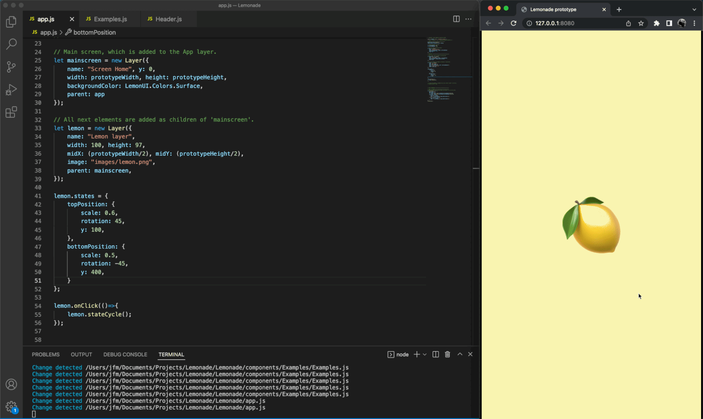

# Lemonade

### A Javascript template built using an obsolete version of Framer.

## [🍋 Demo](https://lmnd.netlify.app/)

#### How to run:

1. Go to the Lemonade folder.
2. Run your preferred local server. For example, type in your terminal: `live-server`



#### Again, this is a zombie version of old Framer. You should be using something else.

Lemonade simply gives you a template to help you kickoff your own thing with old FramerJS.

Most notably, the template comes with a setup `app` layer that you can use as your canvas and add your content inside it.
This `app` layer is then scaled by the `fitToScreen` function so that it fits any browser window.

This is great (I mean, all things considered...) for **remote user research**. Research participants can run your prototype on their device, regardless of which device they're using.

You can delete the Lemonade template and start from scratch a new FramerJS project.

And in that case, here are notes to help you set up a new project.

# Notes and snippets

- **[Layer](#console-log)**
- **[Set Device](#set-device)**
- **[Set Custom Device](#set-custom-device)**
- **[Scroll Component](#scroll-component)**
- **[Page Component](#page-component)**
- **[Flow Component](#flow-component)**
- **[Gotchas](#gotchas)**

## Layer

```javascript
// The basic element in Framer
let layerA = new Layer({
	width: 100,
	height: 100,
	x: 24,
	y: 24,
});
```

Layers are quite extensible, here are all the Layer attributes you can modify.

#### Available attributes and their default values:

```javascript
// For example, you can use: layerA.backgroundColor = 'skyblue'
backgroundColor: Color {color: 'rgba(123, 123, 123, 0.5)', _type: 'rgb', _r: 123, _g: 123, toInspect: ƒ, …}
blur: 0
borderColor: Color {color: 'rgba(123, 123, 123, 0.5)', _type: 'rgb', _r: 123, _g: 123, toInspect: ƒ, …}
borderRadius: 0
borderWidth: 0
brightness: 100
clip: false
color: Color {color: 'white', _type: 'hex', _r: 255, _g: 255, toInspect: ƒ, …}
contrast: 100
flat: false
force2d: false
grayscale: 0
height: 200
hueRotate: 0
ignoreEvents: true
index: 1
invert: 0
opacity: 1
originX: 0.5
originY: 0.5
originZ: 0
perspective: 0
perspectiveOriginX: 0.5
perspectiveOriginY: 0.5
rotationX: 0
rotationY: 0
rotationZ: 0
saturate: 100
scale: 1
scaleX: 1
scaleY: 1
scaleZ: 1
sepia: 0
shadowBlur: 0
shadowColor: Color {color: 'rgba(123, 123, 123, 0.5)', _type: 'rgb', _r: 123, _g: 123, toInspect: ƒ, …}
shadowSpread: 0
shadowX: 0
shadowY: 0
skew: 0
skewX: 0
skewY: 0
visible: true
width: 200
x: 0
y: 0
z: 0
```

[Back to top](#notes-and-snippets)

## Set Device

```javascript
let Device = new DeviceComponent();
Device.setupContext();
Device.deviceType = "apple-iphone-7-gold";
```

[Back to top](#notes-and-snippets)

## Set Custom Device

```javascript
let Device = new DeviceComponent();
Device.setupContext();
// Tablet
Device.customize({
	screenWidth: 720,
	screenHeight: 1024,
	deviceImage: "http://f.cl.ly/items/001L0v3c1f120t0p2z24/custom.png",
	deviceImageWidth: 800,
	deviceImageHeight: 1214,
});
```

[Back to top](#notes-and-snippets)

## Scroll Component

```javascript
// Scroll Component Example
let Device = new DeviceComponent();
Device.setupContext();

let myScroll = new ScrollComponent({
	width: 750,
	height: 1334,
	scrollHorizontal: false,
});

let placeholderContent = new Layer({
	width: 750,
	height: 2500,
	backgroundColor: "skyblue",
	parent: myScroll.content,
});

myScroll.on(Events.Move, function () {
	console.log("Scroll: " + myScroll.scrollY);
});
```

[Back to top](#notes-and-snippets)

## Page Component

```javascript
// Page Component Example
let Device = new DeviceComponent();
Device.setupContext();

let pageCount = 8;
let gutter = 20;

let myPageComponent = new PageComponent({
	width: 750,
	height: 1334,
	scrollVertical: false,
	clip: false,
});

for (let i = 0; i < pageCount; i++) {
	let page = new Layer({
		name: "Page " + i,
		size: myPageComponent.size,
		x: (myPageComponent.width + gutter) * i,
		backgroundColor: "#00AAFF",
		hueRotate: i * 20,
		parent: myPageComponent.content,
	});
	page.onClick(function () {
		console.log("Clicked: " + this.name);
		myPageComponent.snapToPage(this);
	});
}
```

[Back to top](#notes-and-snippets)

## Flow Component

```javascript
// Flow Component Example
Framer.Extras.Hints.disable();

let Device = new DeviceComponent();
Device.setupContext();

let screenA = new Layer({
	size: Screen.size,
	backgroundColor: "#00AAFF",
});

let screenB = new Layer({
	size: Screen.size,
	backgroundColor: "#FFCC33",
	image: Utils.randomImage(),
});

// States
screenA.states = {
	scaleBack: {
		scale: 0.95,
	},
	scaleDefault: {
		scale: 1,
	},
};
screenA.states.animationOptions = {
	curve: "ease-in-out",
	time: 0.2,
};

// Flow
let flow = new FlowComponent({
	size: Screen.size,
});

flow.showNext(screenA);

// Events
screenA.onClick(function () {
	screenA.animate("scaleBack");
	flow.showOverlayBottom(screenB);
	console.log("Show Screen B");
});

screenB.onClick(function () {
	screenA.animate("scaleDefault");
	flow.showPrevious();
	console.log("Show Screen A again");
});
```

[Back to top](#notes-and-snippets)

## Gotchas

> Getting a layer's background color

```javascript
// In the old times, this line would return the value you expect
print(layerA.backgroundColor);

// This is how you'd access the color value now
console.log(layerA.backgroundColor.color);
```

[Back to top](#notes-and-snippets)

---

Notes are WIP, I'll continue to update them and add more examples.

[@72mena](https://twitter.com/72mena)

🍋
